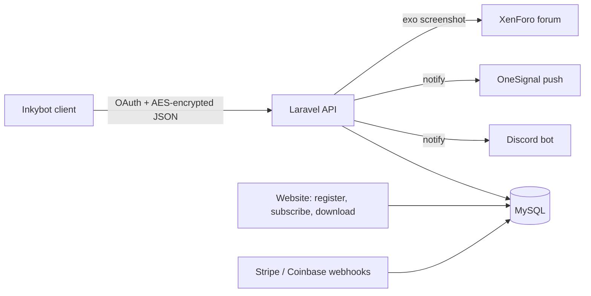

# inkybot-web

Laravel backend and website for Inkybot, a bot that automates "maging" in the MMORPG Dofus. It handles accounts, subscriptions, the encrypted API the desktop client talks to, a Discord bot and public release notes.

## What it is

- The server side of [inkybot](https://github.com/kpolicar/inkybot): every client build logs in here, checks its plan, streams maging statistics back and gets "your item is done" notifications.
- The marketing site (inkybot.me): feature tour, pricing, HTML mock-ups of the client's WinForms setup / config / queue forms, per-version release notes, and a profile page with the user's maging stats and published exo screenshots.
- Ops glue: a Docker Compose stack, Terraform for Hetzner and Cloudflare, and an OpenObserve dashboard for client metrics.

## Background

- Dofus is Ankama's turn-based tactical MMORPG. "Maging" (*forgemagie* / smithmagic) is the profession of re-rolling an item's stats with runes; an "exo" is adding a stat the item never had.
- Inkybot automates that loop on the player's PC. This repo is everything that isn't the bot: who may run it, for how long, and what it reports back.

## How it works

- Auth: Laravel Fortify for the website; Laravel Passport for the client with 5-minute access tokens plus refresh. Each client instance names its token, and a listener enforces one active token per user.
- Encrypted API: bodies and responses pass through `DecryptApiRequest` / `EncryptApiResponse` (AES-256-CBC with a key shared with the client); `/publish` also needs a signed `Authorization-Signature` header. Routes are versioned per client release (`/api/v3.2/...`).
- Entitlements: Cashier + Stripe subscriptions (starter, standard, unlimited, unlimited-with-queue), Coinbase Commerce for crypto, and a one-hour `FreeTrial` keyed by user and IP. Gates like `create-statistics`, `custom-maging-ai` and `maging-queue` decide which client features unlock.
- Statistics: the client posts rune attempts, exo attempts and successes, kamas spent and time maging; `Maging` rows feed profile charts, an Excel export and scheduled daily reports.
- Notifications: `/notify/*` fans out to Discord (through the bundled `discordapp/` bot, built on DiscordPHP) and OneSignal web push. Published mages are watermarked and cross-posted to a XenForo forum.
- Content: Blade views in English and French (mcamara/laravel-localization), Tailwind CSS via Laravel Mix; release notes live in `resources/views/release/{n}.blade.php`, one per client version.

## Tech stack

- PHP 7.4 / Laravel 8, MySQL, Blade, Tailwind CSS 1, Chart.js.
- Fortify, Passport, Cashier (Stripe), Coinbase Commerce, OneSignal, Postmark, DiscordPHP, Intervention Image, Maatwebsite Excel.
- Docker (php-fpm, Caddy, MySQL, cron, Discord bot, phpMyAdmin), Terraform (Hetzner firewall, Cloudflare rate limits), OpenObserve, GitHub Actions (legacy Azure deploy on `prod`).

## Repository layout

- `app/Http/Controllers/ApiController.php` + `routes/api.php` - the client-facing API.
- `app/Http/Middleware/` - API encryption, signature auth, subscription gates.
- `discordapp/` - standalone Discord bot process: `!login` account linking, reaction roles, notification relay.
- `infra/` - Caddyfile, cron, entrypoint, Terraform for Hetzner and Cloudflare. `openobserve/` - observability stack and dashboard.
- `winforms-translations/` - `.resx` translations copied from the desktop client's forms.

## Running it

- `cp .env.example .env`, fill in DB, Stripe and Discord keys, then `docker compose up -d`; migrations run on container start. Note the Dockerfile and compose file reference `docker/`, while those files currently live in `infra/docker/`.
- Front-end assets: `npm install && npm run production`.

## Related

- [inkybot](https://github.com/kpolicar/inkybot) - the Windows client this backend serves.

## Status

Personal project, not affiliated with Ankama SAS. The hosted service at inkybot.me is no longer running; the client's latest build ships in offline mode. Source is not licensed for redistribution (see `LICENSE`).
