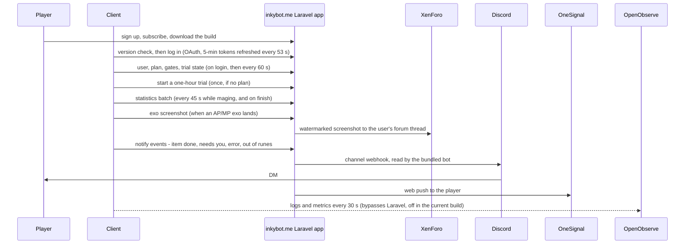

# inkybot-web

Laravel backend and website for Inkybot, a bot that automates "maging" (re-rolling item stats with runes) in the MMORPG Dofus: accounts, subscriptions, an encrypted client API, a Discord bot and release notes.

## What it is

- The server half of [inkybot](https://github.com/kpolicar/inkybot): the client logs in here, learns which features its plan unlocks, reports rune statistics, and gets "your item is done" notifications.
- A real subscription product: four Stripe plans, Coinbase Commerce crypto checkout, one-hour trials keyed by user or IP, and seven plan-based feature gates that the client honours.
- Solo project, ~530 commits, live from 2020: Azure App Service until 2023 (`prod` branch), re-platformed in March 2026 to Docker on Hetzner behind Cloudflare with a SQL Server to MySQL migration. Plans went free in Feb 2026.

## Background

- Dofus is Ankama's turn-based tactical MMORPG; "maging" is the profession of re-rolling an item's stats with runes, and an "exo" (a stat the item never had) is the prize players chase.
- This repo decides who may run the bot and for how long, and collects what it reports back: exo successes count against the plan and are watermarked and forum-posted.

## How it works

- **Auth.** Fortify for the website; Passport for the client. Each instance names its token and a listener caps concurrent instances at the subscription quantity. OAuth and statistics bodies plus most responses are AES-256-CBC encrypted with a shared key; `/publish` adds a shared-secret header.
- **Entitlements.** Cashier + Stripe (starter, standard, unlimited, unlimited-with-queue), Coinbase Commerce, `FreeTrial` rows; gates such as `create-statistics`, `custom-maging-ai` and `maging-queue` guard routes under `/api/{version}`, whose segment also selects the user-resource shape. Throttles are mirrored as Cloudflare edge limits.
- **Statistics and publishing.** Batches carry rune attempts per stat and tier, exo attempts and successes, kamas spent and time maging into `Maging` rows that feed profile charts, an Excel export and nightly reports. Screenshots are watermarked, stored per user and counted against the plan's exo quota.
- **Notifications.** Laravel never talks to the bot directly: it posts a `!notify` line to a Discord channel webhook, and the DiscordPHP bot in `discordapp/` turns it into a DM (it also handles `!login` linking and reaction roles). Push and DMs both require the user's opt-in.

## Tech stack

- PHP 7.4 / Laravel 8, MySQL 8, Blade + Tailwind via Laravel Mix, Chart.js; English and French with translated route slugs; 24 release-note pages under `resources/views/release/`.
- Fortify, Passport, Cashier (Stripe), Coinbase Commerce, DiscordPHP, OneSignal, Intervention Image, Maatwebsite Excel, reCAPTCHA, Google Analytics.
- Docker Compose (php-fpm, Caddy, MySQL, cron, Discord bot), Terraform (Hetzner firewall, Cloudflare rate limits), an OpenObserve dashboard of client telemetry, GitHub Actions (legacy Azure deploy on `prod`).

## Repository layout

- `app/Http/Controllers/ApiController.php` + `routes/api.php` — the client-facing API; start here.
- `app/Providers/AuthServiceProvider.php`, `app/Http/Middleware/` — Passport setup, plan gates, API encryption.
- `discordapp/`, `infra/`, `openobserve/` — the Discord bot process; Caddy, cron and Terraform; the telemetry stack and its 30-panel dashboard.

## Running it

`cp .env.example .env` (DB, Stripe and Discord keys), then `docker compose up -d`; migrations run on container start. Known issue: `Dockerfile` and `docker-compose.yml` reference `docker/` but the files live in `infra/docker/`, so symlink first; only the stock Laravel example tests exist.

## Related

- [inkybot](https://github.com/kpolicar/inkybot) — the Windows client; its release workflow can copy each build into this app's public storage, which `/download` serves.

## Status

Service at inkybot.me shut down; the client's latest build (July 2026) runs offline.
Personal project by Klemen Poličar. Not affiliated with Ankama SAS; Dofus is their trademark. Source is not licensed for redistribution (see `LICENSE`).
